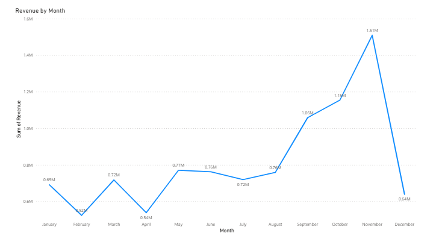
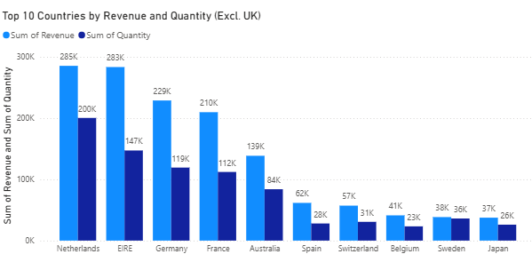
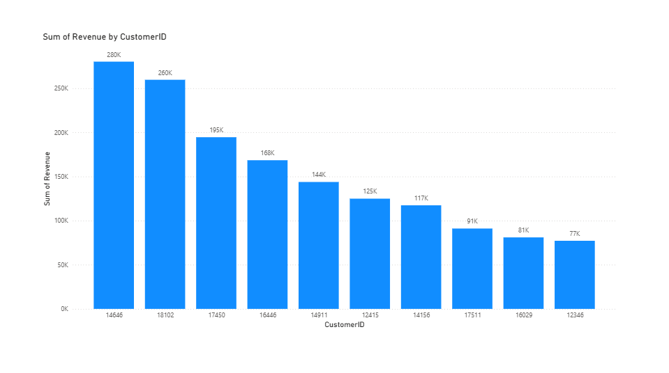
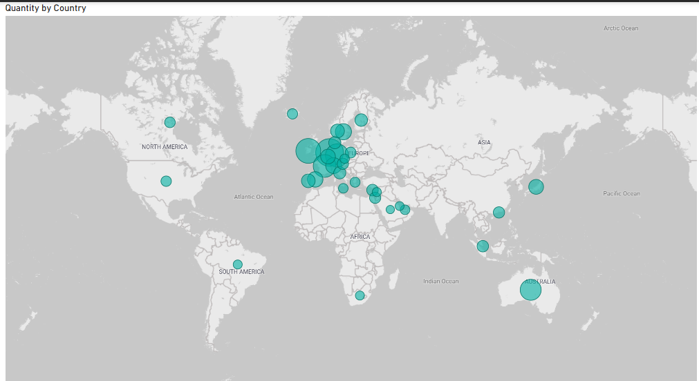

# Online Retail Data Analysis (Power BI)

## Overview
This project analyzes online retail transaction data using Power BI to identify revenue trends, top-performing countries, high-value customers, and global product demand.

The goal of this analysis is to support executive decision-making for revenue forecasting, customer retention, marketing strategy, and international expansion.

## Business Questions
1. What are the monthly revenue trends in 2011?
2. Which countries generated the highest revenue and quantity sold, excluding the UK?
3. Who are the top 10 customers by revenue?
4. Which countries show the highest product demand, excluding the UK?

## Data Cleaning
Data cleaning and transformation were performed in Power BI before analysis.

Cleaning steps included:
- Removed records where quantity was below 1
- Removed records where unit price was below 0
- Excluded the United Kingdom from country-level expansion analysis where required

## Dashboard Visuals

### Monthly Revenue Trend (2011)

### Top 10 Countries by Revenue and Quantity (Excl. UK)

### Top 10 Customers by Revenue

### Global Product Demand by Country (Excl. UK)

## Key Insights
- Revenue increased significantly toward the end of 2011, with a peak in November, suggesting strong seasonal demand.
- The Netherlands, Ireland, Germany, and France were among the strongest international markets outside the UK.
- A small group of customers generated a large share of revenue, highlighting the importance of customer retention.
- Product demand was concentrated mainly in European markets, with additional expansion opportunities visible in countries such as Australia and Japan.

## Tools Used
- Power BI
- Excel

## Files Included
- Power BI dashboard file
- Online retail dataset
- Dashboard screenshots
